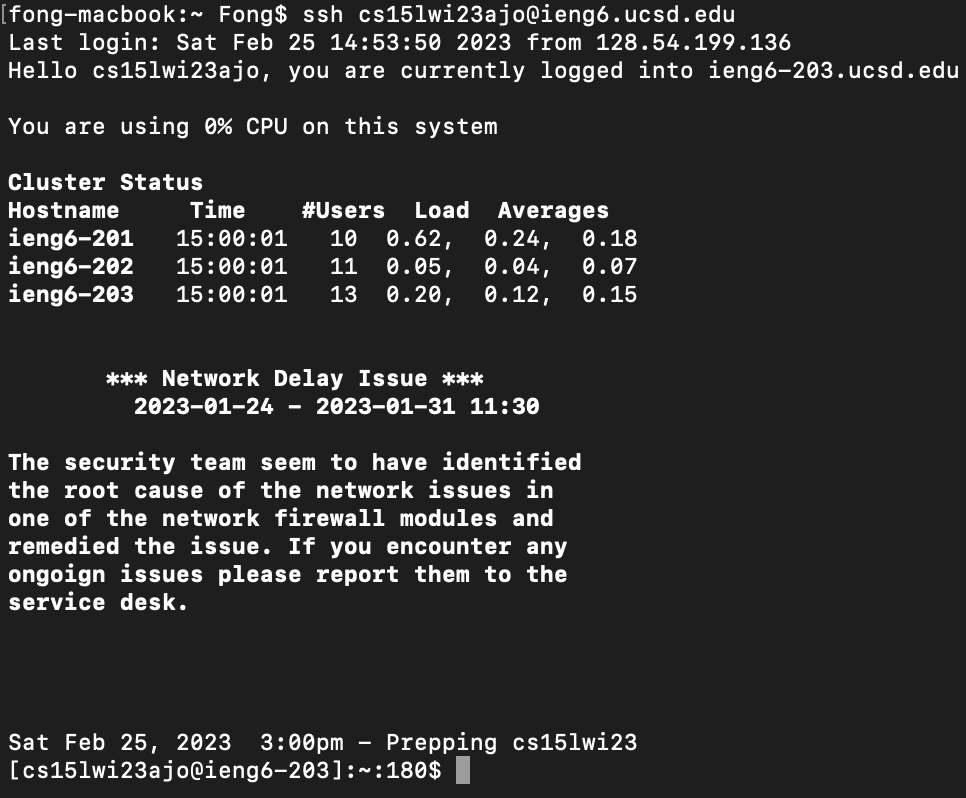

# Lab Report 4

## Task 1: Log into ieng6

Since I have already set up the ssh key on my computer and my ieng6 account, I can simply ssh into the account without having to typed the password. Moreover, since I have recently used the ssh command, I simply pressed `<up><enter>` to access previous ssh command.

---

## Task 2: Clone your fork of the repository from your Github account

Next we run the git clone command to clone the forked repository onto the ieng6 server. Here I manually typed everything since there is no previous history of typing this command down.

---

## Task 3: Run the tests, demonstrating that they fail

Here I cd into the recently cloned directory by typing down `cd cse<tab>` which auto completes to `cd cse15l-lab7/`.

After that I typed in `ls` to see the files in this directory, and to run the JUnit test, we first need to compile the files. I did this by pressing `<control+R>` to search for previously used command. With this search bar, I typed in `javac` which brought up the `javac -cp .:lib/hamcrest-core-1.3.jar:lib/junit-4.13.2.jar *.java` command. After this I hit `<enter>` to run the suggested command.

After that, I pressed `<control+R>` again to search for command history, and this time I typed in `java -cp` which brought up my previously used command `java -cp .:lib/hamcrest-core-1.3.jar:lib/junit-4.13.2.jar org.junit.runner.JUnitCore FileServerTest`.

In order to run the correct test, I had to change the file name at the end, and I did this by pressing `<right arrow><control+E>` to go to the end of the line. I then press delete key to delete the `FileServerTest` and replaced it with `ListExamplesTests`. After this, I ran the command and found that the test failed.

---

# Task 4: Edit the code file to fix the failing test

To edit the file, typed in `nano <tab>` to bring up all the files name

I then typed in `nano Lis<tab>.j<tab>` which auto completes to `nano ListExamples.java` and I pressed `<enter>` which brought up nano.

I then navigate to the line that caused the test to fail using arrow keys and change `index1` to `index2` as shown in the highlighted part of the image below.

I then saved the file using `<control+o><enter>` and exit using `<control+x>`.

---

# Task 5: Run the tests, demonstrating that they now succeed

To recompile the files, I pressed `<up><up><enter>` to run `javac -cp .:lib/hamcrest-core-1.3.jar:lib/junit-4.13.2.jar *.java` again by accessing the command in the history. Next, to run the JUnit test I also pressed `<up><up><enter>` to run `java -cp .:lib/hamcrest-core-1.3.jar:lib/junit-4.13.2.jar org.junit.runner.JUnitCore ListExamplesTests`.

This then showed that we passed the tests.

---

## Task 6: Commit and push the resulting change to your Github account

To commit and push the changes to the GitHub repo. I manually typed in `git add -A` to add all changes. Then, `git commit -m "fix bug"` to commit the changes. 

Lastly, I typed in `git push` to push the changes to my forked repo. This prompted me to input my username and github token which I did for authentication.

And Voila! We have completed all the steps.