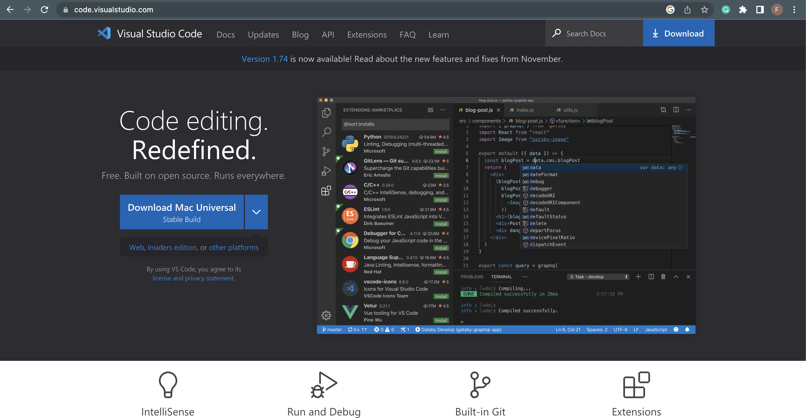
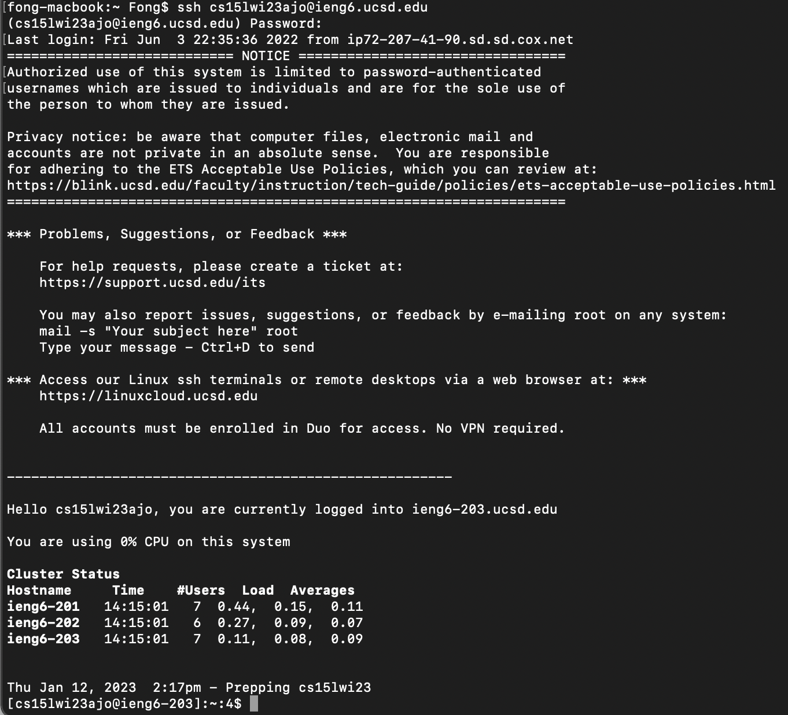

# Week 1 Lab Report

## Section 1: Installing VScode

In order to install VScode go to [this link](https://code.visualstudio.com/) which will bring you to the page that look like the screenshot below. 

Click the big blue button that says "Download" then follow the usuall step for installing a software on your operating system.

---

## Section 2: Remotely connecting to a course-specific account on ieng6 using SSH

In this section, we will show you how you can remotely connect to your account on ieng6 through your terminal using the SSH (Secure Shell Protocol).

In order to do this, you must have 2 things:
* Your ieng6 user id
* the password to that account

For all CSE 15L students in the Winter 2023 quarter, the account id will look something like **cs15lwi23xxx** where **xxx** will vary between users.

In order to SSH into this account we need to type the following into the terminal (with the user-specific id replaced by your own)

```
ssh cs15lwi23xxx@ieng6.ucsd.edu
```

If this is the first time your computer is being logged into this SSH, this prompt will pop up

```
The authenticity of host 'ieng6-202.ucsd.edu (128.54.70.227)' can't be established.
RSA key fingerprint is SHA256:xxxxxxxxxxxxxxx.
Are you sure you want to continue connecting (yes/no/[fingerprint])?
```

input `yes`

After this, the terminal will prompt you to input your password. Once the correct password has been entered, you will see something like the screenshot below

