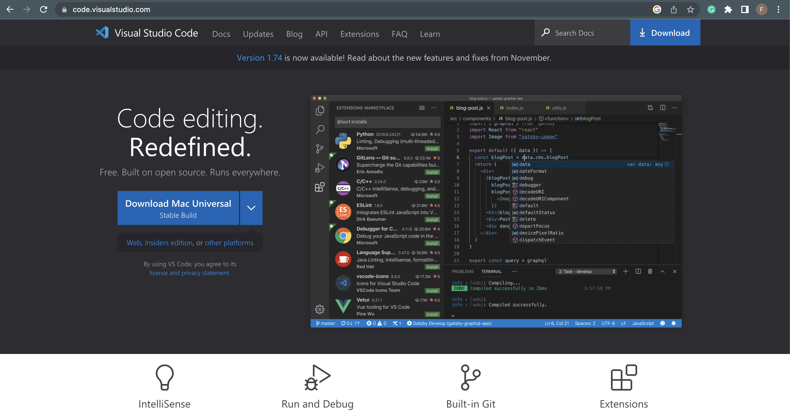
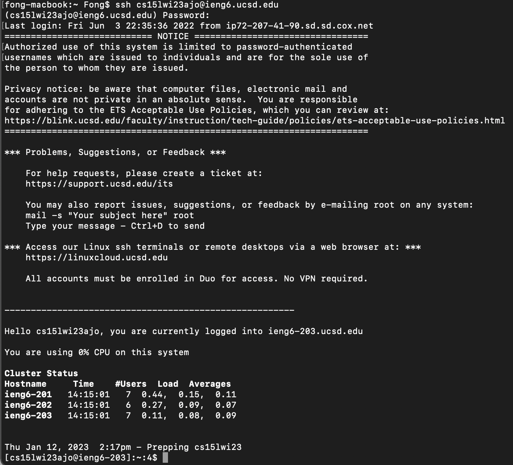
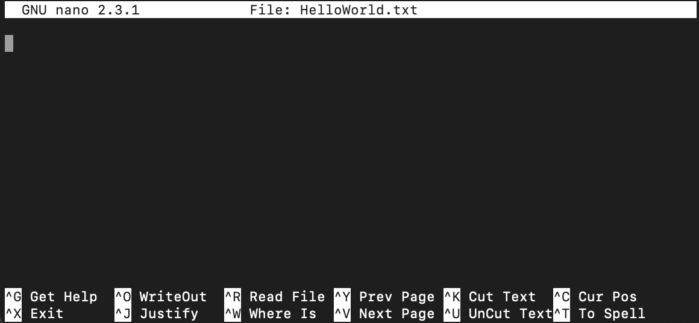
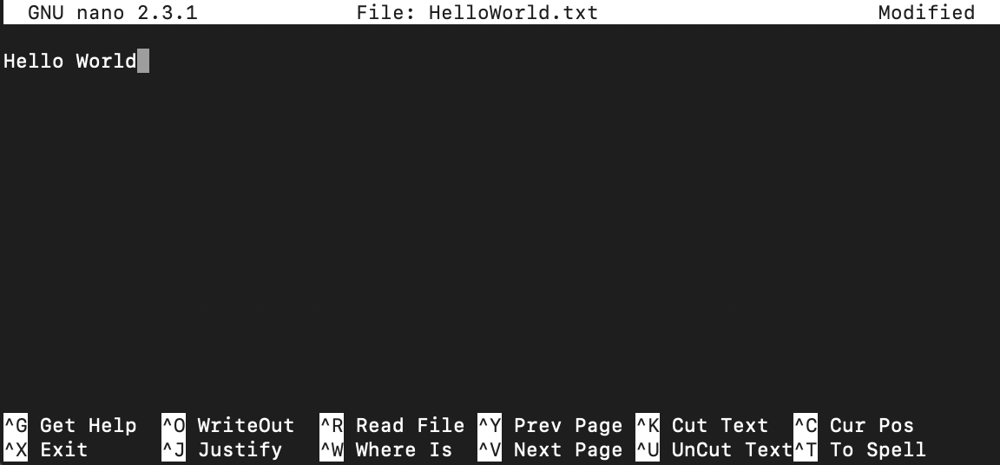
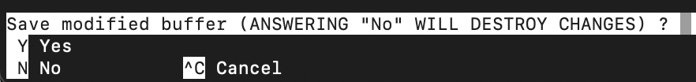
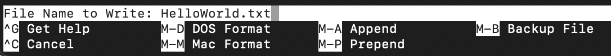

# Week 1 Lab Report

## Section 1: Installing VScode

In order to install VScode go to [this link](https://code.visualstudio.com/) which will bring you to the page that look like the screenshot below. 

Click the big blue button that says "Download" then follow the usuall step for installing a software on your operating system.

---

## Section 2: Remotely connecting to a course-specific account on ieng6 using SSH

In this section, we will show you how you can remotely connect to your account on ieng6 through your terminal using the SSH (Secure Shell Protocol).

In order to do this, you must have 2 things:
* Your ieng6 user id
* the password to that account

For all CSE 15L students in the Winter 2023 quarter, the account id will look something like **cs15lwi23xxx** where **xxx** will vary between users.

In order to SSH into this account we need to type the following into the terminal (with the user-specific id replaced by your own)

```
ssh cs15lwi23xxx@ieng6.ucsd.edu
```

If this is the first time your computer is being logged into this SSH, this prompt will pop up

```
The authenticity of host 'ieng6-202.ucsd.edu (128.54.70.227)' can't be established.
RSA key fingerprint is SHA256:xxxxxxxxxxxxxxx.
Are you sure you want to continue connecting (yes/no/[fingerprint])?
```

input `yes`

After this, the terminal will prompt you to input your password. Once the correct password has been entered, you will see something like the screenshot below



Voila! You've successfully ssh into your ieng6 account.

---

## Section 3: Running some command

In this section, we will be running some basic commands like `pwd`, `ls`, `mkdir`, `cd`, `touch`, `cat` while and edit text files using `nano`.

First we can check what is the current working directory using the `pwd` command

```
[cs15lwi23ajo@ieng6-203]:~:33$ pwd
/home/linux/ieng6/cs15lwi23/cs15lwi23ajo
```

As shown above, we are in the `/home/linux/ieng6/cs15lwi23/cs15lwi23ajo` directory

From here, we can check the content of the current working directory using the `ls` command

```
[cs15lwi23ajo@ieng6-203]:~:34$ ls
perl5
```

As shown in the snippet above, we have one content in this directory called `perl5`

We can create a new directory using the `mkdir <directory name>` command

```
[cs15lwi23ajo@ieng6-203]:~:35$ mkdir lab1
[cs15lwi23ajo@ieng6-203]:~:36$ ls
lab1  perl5
```

In the snipped above, we have created a new directory called `lab1`, and using the `ls` command, we can see that `lab1` directory has been created.

We can change the current directory using the `cd <path>` command. 

```
[cs15lwi23ajo@ieng6-203]:~:37$ cd lab1 
[cs15lwi23ajo@ieng6-203]:lab1:38$ pwd 
/home/linux/ieng6/cs15lwi23/cs15lwi23ajo/lab1
```

In this case, we wanted to change the current directory to the newly created one using the `cd lab1` command. Using the `pwd` command we can check that we have successfully changed the current working directory.

We can then create a new file using `touch <file>` command as shown below.

```
[cs15lwi23ajo@ieng6-203]:lab1:39$ touch HelloWorld.txt
[cs15lwi23ajo@ieng6-203]:lab1:40$ ls
HelloWorld.txt
```

In order to edit the content of the file, we can use a tool called `nano` by typing in the command `nano <file>`. For example, if we want to edit the `HelloWorld.txt` file that we have just created, we can type in `nano HelloWorld.txt` which will bring up the interface below.



Here, you can type in the content of the file.



To save the changes, press `ctrl + x`, and the following prompt will pop up



Press `Y`



Press `Enter`

We can then use `cat` command to check the content of the file

```
[cs15lwi23ajo@ieng6-203]:lab1:42$ cat HelloWorld.txt
Hello World
```
