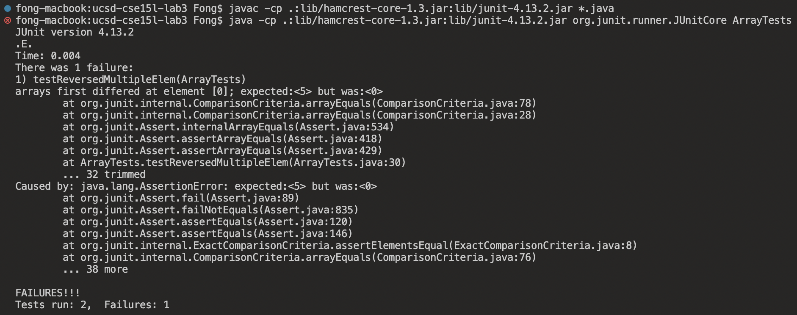

# Lab Report 2 (Week 2 - 3)

## Part 1: String server

Here we are creating a simple server service that will record string data send to the endpoint `http://localhost:<PORT>/add-message?s=<string>` and it will send back all the recorded string as a response.

For example, if we want to add the text `Hello`, and suppose that our server is running on port 1111, we can make a get request to `http://localhost:1111/add-message?s=Hello` and we will get the following response:


We can add more text to the response by making a request to `http://localhost:1111/add-message?s=How are you`


As you can see in the image, the response that our server send back contain the history of all the string we sent to the server through the query `?s=<string>` to the path `/add-message`. Moreover, if we look at the url bar in the screenshot, we can see that `?s=How are you` got parsed into `?s=How%20are%20you`. The `%20` represents a space. This parsing action is done by the browser, but the value that the server received is still `How are you`.

Now, let's look at the code that make this possible.

```java
// StringServer.java

import java.io.IOException;
import java.net.URI;
import java.util.ArrayList;

class Handler implements URLHandler {
    // The one bit of state on the server: a number that will be manipulated by
    // various requests.
    int num = 0;
    ArrayList<String> addedString = new ArrayList<>();

    public String handleRequest(URI url) {
        if (url.getPath().equals("/add-message")) {
            
            String[] parameters = url.getQuery().split("=");
            if(parameters[0].equals("s")){
                addedString.add(parameters[1]);
                
                String response = "";
        
                for(int i = 0; i < addedString.size(); i++){
                    response += addedString.get(i) + "\n";
                }

                return response;
            }

        } 

        return "404 Not Found!";
    }
    
}

class StringServer {
    public static void main(String[] args) throws IOException {
        if(args.length == 0){
            System.out.println("Missing port number! Try any number between 1024 to 49151");
            return;
        }

        int port = Integer.parseInt(args[0]);

        Server.start(port, new Handler());
    }
}
```

We can start the server using the command below
```
$ javac Server.java StringServer.java
$ java StringServer 1111
```

You can see that in the second line of the command above, we run the compiled java code with an argument `1111`, and if you look in the code in the StringServer's main method, we use that argument as a port for our server, and use the class Handler as our request handler.

The method `public String handleRequest(URI url)` is where we put the functionality of our program. Going back to the first screenshot, when we make the request to the `http://localhost:1111/add-message?s=Hello` url, this method is called. What it does is, it takes in the url as a method parameter and parse it to check what the request is for. In this case, the code `if (url.getPath().equals("/add-message"))` check if the url that the request was made to has the `/add-message` path or not. If the request was made to that endpoint, our program will parse the query (which is the content behind the `?` in the url) using `url.getQuery().split("=")`, and in this case, what we will get is a string array `String[]{"s", "Hello"}` (the element at index 0 represents the key of the query while the element at index 1 represents the value). The code will check if the key equals to `s`, it will save the value to memory in an `ArrayList` we have created and return that ArrayList as string as a HTTP response.

For the second screenshot, the only difference here is the value on the right handside of the `=` in the query, which is `How are you`. Thus, `how are you` is added to the array list in the memory and `Hello` and `How are you` are displayed as a response.

---

## Part 2: JUnit, bugs and symptoms

In this section, we will examine one of the bugs from lab 3. The code that I have chosen to focus on today is the `reversed` method in the `ArrayExample` class with the purpose of taking in an array as a parameter and return a new array that resembles the original but in the reversed order. Shown below is the code for this method.

```java
// ArrayExample.java

public class ArrayExamples {
    // Returns a *new* array with all the elements of the input array 
    // in reversed order
    static int[] reversed(int[] arr) {
        int[] newArray = new int[arr.length];
        for(int i = 0; i < arr.length; i += 1) {
            arr[i] = newArray[arr.length - i - 1];
        }
        return arr;
    }
}
```

In order to demonstrate that this is a buggy code, we can write a simple JUnit test to see if the code does what is expected or not.

```java
// ArrayTest.java

import static org.junit.Assert.*;
import org.junit.*;

public class ArrayTests {

    @Test
    public void testReversedMultipleElem() {
        int[] input1 = { 3, 4, 5 };
        assertArrayEquals(new int[]{ 5, 4, 3 }, 
                ArrayExamples.reversed(input1));
    }

}

```

We can write a simple table explaining what this JUnit test is trying to check.

| Input     | Expected  |
|-----------|-----------|
| [3, 4, 5] | [5, 4, 3] |

If we run the JUnit test, we will get the following result:

```
$ javac -cp .:lib/hamcrest-core-1.3.jar:lib/junit-4.13.2.jar *.java
$ java -cp .:lib/hamcrest-core-1.3.jar:lib/junit-4.13.2.jar org.junit.runner.JUnitCore ArrayTests
JUnit version 4.13.2
.E
Time: 0.003
There was 1 failure:
1) testReversedMultipleElem(ArrayTests)
arrays first differed at element [0]; expected:<5> but was:<0>
        at org.junit.internal.ComparisonCriteria.arrayEquals(ComparisonCriteria.java:78)
        at org.junit.internal.ComparisonCriteria.arrayEquals(ComparisonCriteria.java:28)
        at org.junit.Assert.internalArrayEquals(Assert.java:534)
        at org.junit.Assert.assertArrayEquals(Assert.java:418)
        at org.junit.Assert.assertArrayEquals(Assert.java:429)
        at ArrayTests.testReversedMultipleElem(ArrayTests.java:29)
        ... 32 trimmed
Caused by: java.lang.AssertionError: expected:<5> but was:<0>
        at org.junit.Assert.fail(Assert.java:89)
        at org.junit.Assert.failNotEquals(Assert.java:835)
        at org.junit.Assert.assertEquals(Assert.java:120)
        at org.junit.Assert.assertEquals(Assert.java:146)
        at org.junit.internal.ExactComparisonCriteria.assertElementsEqual(ExactComparisonCriteria.java:8)
        at org.junit.internal.ComparisonCriteria.arrayEquals(ComparisonCriteria.java:76)
        ... 38 more

FAILURES!!!
Tests run: 1,  Failures: 1
```

From the example above, we can see that our code did not pass the JUnit test. Going back to the table, we can add another column called actual and see what the program did that caused the test to fail.

| Input     | Expected  | Actual    |
|-----------|-----------|-----------|
| [3, 4, 5] | [5, 4, 3] | [0, 0, 0] |

As you can see, instead of returning `[5, 4, 3]` as expected, the program returned `[0, 0, 0]`.

However, even though this program contains a bug, it doesn't mean that we could not write a test that pass. For example, if we use the following JUnit test

```java
// ArrayTest.java

import static org.junit.Assert.*;
import org.junit.*;

public class ArrayTests {

    @Test
    public void testReversed() {
        int[] input1 = { };
        assertArrayEquals(new int[]{ }, ArrayExamples.reversed(input1));
    }

}

```

and run it

```
$ javac -cp .:lib/hamcrest-core-1.3.jar:lib/junit-4.13.2.jar *.java
$ java -cp .:lib/hamcrest-core-1.3.jar:lib/junit-4.13.2.jar org.junit.runner.JUnitCore ArrayTests
JUnit version 4.13.2
.
Time: 0.003

OK (1 test)
```

We can see that the test passed. The test that passed can be explain as the following:

| Input | Expected | Actual |
|-------|----------|--------|
| []    | []       | []     |

The following is the screen shot of the symptom



Now, it is time to fix that bug. Going back to the original code

```java
// ArrayExample.java

public class ArrayExamples {
    // Returns a *new* array with all the elements of the input array 
    // in reversed order
    static int[] reversed(int[] arr) {
        int[] newArray = new int[arr.length];
        for(int i = 0; i < arr.length; i += 1) {
            arr[i] = newArray[arr.length - i - 1]; // Line 1
        }
        return arr; // Line 2
    }
}
```

We can see that there are two problematic points that have caused this bug. Those two points are lebeled `Line 1` and `Line 2`. 

Looking at `Line 1` we can see that, since we need to copy elements from the original array to the new array, we need to write `newArray[arr.length - i - 1] = arr[i];` instead.

On `Line 2`, we need to return the new reversed array instead of the old array. Thus, we replace that line with `return newArray;`.

With these two simple fixes, we will receive the following code:

```java
// ArrayExample.java

public class ArrayExamples {
    // Returns a *new* array with all the elements of the input  
    // array in reversed order
    static int[] reversed(int[] arr) {
        int[] newArray = new int[arr.length];
        for(int i = 0; i < arr.length; i += 1) {
            newArray[arr.length - i - 1] = arr[i];
        }
        return newArray;
    }
}
```

And if we run the JUnit tests that we have wrote earlier with this new code, we will get the following output:

```
$ javac -cp .:lib/hamcrest-core-1.3.jar:lib/junit-4.13.2.jar *.java
$ java -cp .:lib/hamcrest-core-1.3.jar:lib/junit-4.13.2.jar org.junit.runner.JUnitCore ArrayTests
JUnit version 4.13.2
..
Time: 0.003

OK (2 tests)
```

As you can see from `..` and the message `OK (2 tests)`, both of our tests, including what used to be an error inducing test, have passed.

---

## Part 3: Week 2-3 Lab reflection

Over the past two weeks, I have learned about a systematic ways to create unit tests that will try to break our code to ensure that we will be able to spot bugs and fix them before our code reach its intended users. Moreover, it has made me realize how useful the process of writing tests are to programming as it would make you think of all the possible ways to break your program, and as a result, you would write a less buggy program.