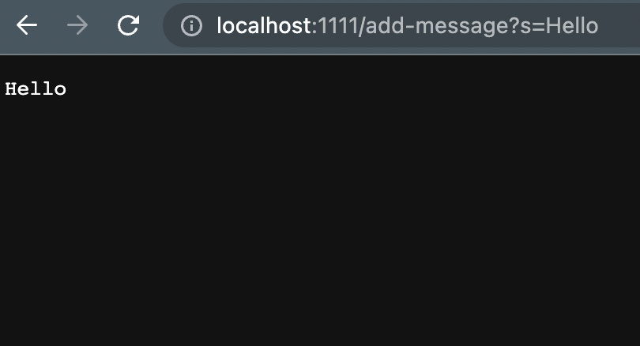
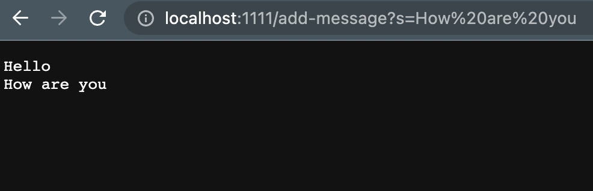

# Lab Report 2 (Week 2 - 3)

## Part 1: String server

Here we are creating a simple server service that will record string data send to the endpoint `http://localhost:<PORT>/add-message?s=<string>` and it will send back all the recorded string as a response.

For example, if we want to add the text `Hello`, and suppose that our server is running on port 1111, we can make a get request to `http://localhost:1111/add-message?s=Hello` and we will get the following response:



We can add more text to the response by making a request to `http://localhost:1111/add-message?s=How are you`



As you can see in the image, the response that our server send back contain the history of all the string we sent to the server through the query `?s=<string>` to the path `/add-message`. Moreover, if we look at the url bar in the screenshot, we can see that `?s=How are you` got parsed into `?s=How%20are%20you`. The `%20` represents a space. This parsing action is done by the browser, but the value that the server received is still `How are you`.

Now, let's look at the code that make this possible.

```java
// StringServer.java

import java.io.IOException;
import java.net.URI;
import java.util.ArrayList;

class Handler implements URLHandler {
    // The one bit of state on the server: a number that will be manipulated by
    // various requests.
    int num = 0;
    ArrayList<String> addedString = new ArrayList<>();

    public String handleRequest(URI url) {
        if (url.getPath().equals("/add-message")) {
            
            String[] parameters = url.getQuery().split("=");
            if(parameters[0].equals("s")){
                addedString.add(parameters[1]);
                
                String response = "";
        
                for(int i = 0; i < addedString.size(); i++){
                    response += addedString.get(i) + "\n";
                }

                return response;
            }

        } 

        return "404 Not Found!";
    }
    
}

class StringServer {
    public static void main(String[] args) throws IOException {
        if(args.length == 0){
            System.out.println("Missing port number! Try any number between 1024 to 49151");
            return;
        }

        int port = Integer.parseInt(args[0]);

        Server.start(port, new Handler());
    }
}
```

We can start the server using the command below
```
$ javac Server.java StringServer.java
$ java StringServer 1111
```

You can see that in the second line of the command above, we run the compiled java code with an argument `1111`, and if you look in the code in the StringServer's main method, we use that argument as a port for our server, and use the class Handler as our request handler.

The method `public String handleRequest(URI url)` is where we put the functionality of our program. Going back to the first screenshot, when we make the request to the `http://localhost:1111/add-message?s=Hello` url, this method is called. What it does is, it takes in the url as a method parameter and parse it to check what the request is for. In this case, the code `if (url.getPath().equals("/add-message"))` check if the url that the request was made to has the `/add-message` path or not. If the request was made to that endpoint, our program will parse the query (which is the content behind the `?` in the url) using `url.getQuery().split("=")`, and in this case, what we will get is a string array `String[]{"s", "Hello"}` (the element at index 0 represents the key of the query while the element at index 1 represents the value). The code will check if the key equals to `s`, it will save the value to memory in an `ArrayList` we have created and return that ArrayList as string as a HTTP response.

For the second screenshot, the only difference here is the value on the right handside of the `=` in the query, which is `How are you`. Thus, `how are you` is added to the array list in the memory and `Hello` and `How are you` are displayed as a response.