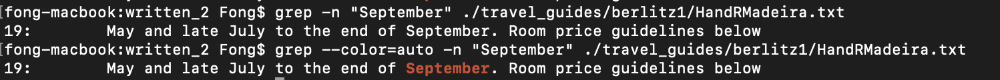
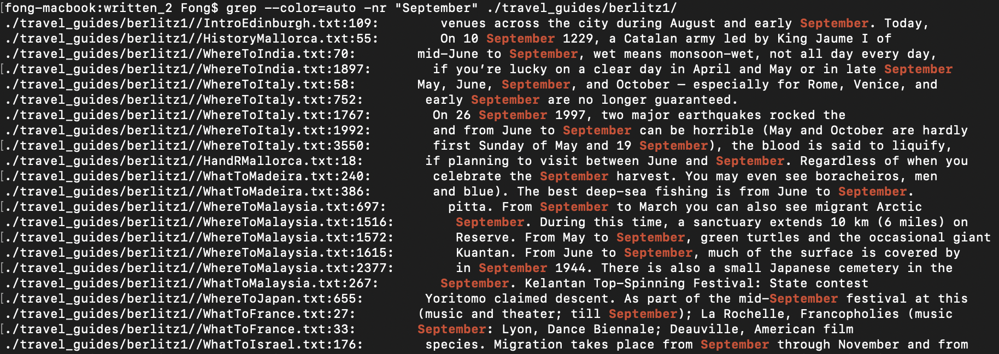

# Lab Report 3 (Week 4)

<!-- https://geekflare.com/grep-command-examples/

Inverse Search

```
$ grep -v [pattern] [file]
```

Display Additional Lines

```
grep -A[num] [pattern] [file]
grep -B[num] [pattern] [file]
grep -C[num] [pattern] [file]
```

https://linuxhandbook.com/grep-command-examples/
Change color

```
$ grep -r --color=green [pattern] [file]
```

https://javarevisited.blogspot.com/2011/06/10-examples-of-grep-command-in-unix-and.html#axzz7syk3Aq00

Count
```
$ grep -C [pattern] [file]
``` -->

## Interesting command-line options for grep 1: -v option

The first seemingly interesting and useful command line option for grep is the inverse search feature. What this does is it will tell grep to exclude the pattern that was supplied to it.

To use this feature, we simply add the tag `-v` to our grep command and it will invert the usual grep command. The following is the example of its usage on the `./written_2` directory.

```
fong-macbook:written_2 Fong$ cat -n ./travel_guides/berlitz1/HandRIbiza.txt
     1	
     2	  
     3	  
     4	    
     5	      
     6	        Recommended Hotels
     7	        The establishments listed below offer a cross-section of
     8	        local restaurants, and should convince you that not everything on the
     9	        island comes with chips (french fries).
    10	        The star rating in brackets after each entry refers to the
    11	        offfical government rating system.
    12	        As a basic guide, the symbols we use indicate what you can
    13	        expect to pay for a three-course meal for two, excluding wine, tax and
    14	        tip. Drinks will add considerably to the final bill.
    15	        ✪less than 5,000 ptas.
    16	        ✪✪5,000–8,000 ptas.
    17	        ✪✪✪more than 8,000 ptas.
    18	      
    19	    
    20	  
fong-macbook:written_2 Fong$ grep -v -n "fries" ./travel_guides/berlitz1/HandRIbiza.txt
1:
2:  
3:  
4:    
5:      
6:        Recommended Hotels
7:        The establishments listed below offer a cross-section of
8:        local restaurants, and should convince you that not everything on the
10:        The star rating in brackets after each entry refers to the
11:        offfical government rating system.
12:        As a basic guide, the symbols we use indicate what you can
13:        expect to pay for a three-course meal for two, excluding wine, tax and
14:        tip. Drinks will add considerably to the final bill.
15:        ✪less than 5,000 ptas.
16:        ✪✪5,000–8,000 ptas.
17:        ✪✪✪more than 8,000 ptas.
18:      
19:    
20:  
```

Here we have typed in two commands, the first one is a cat command to print out the content of the files named `HandRIbiza.txt`. The second is a grep command to display all the line that doesn't include the word `fries`. If you look at the output from `cat` you can see that the word `fries` is on line 9, and if you look at the output from `grep`, you can see that line 9 is not in it. This is because we have included the `-v` option in the grep command, telling it to exclude the line with the word `fries`.

This command-line options can also be used to search for all files that don't contain specific words. For example:

```
fong-macbook:written_2 Fong$ grep -vlr "people" --include="*.txt" ./travel_guides/berlitz1
./travel_guides/berlitz1/HandRLasVegas.txt
./travel_guides/berlitz1/HistoryJapan.txt
./travel_guides/berlitz1/IntroMalaysia.txt
./travel_guides/berlitz1/HandRIstanbul.txt
./travel_guides/berlitz1/HistoryJamaica.txt
./travel_guides/berlitz1/HandRJamaica.txt
./travel_guides/berlitz1/HandRHongKong.txt
./travel_guides/berlitz1/HistoryEgypt.txt
./travel_guides/berlitz1/IntroEdinburgh.txt
./travel_guides/berlitz1/HistoryIsrael.txt
./travel_guides/berlitz1/IntroDublin.txt
./travel_guides/berlitz1/HistoryIndia.txt
./travel_guides/berlitz1/IntroFrance.txt
./travel_guides/berlitz1/IntroMadeira.txt
./travel_guides/berlitz1/WhatToLakeDistrict.txt
./travel_guides/berlitz1/IntroIbiza.txt
./travel_guides/berlitz1/HistoryItaly.txt
./travel_guides/berlitz1/WhereToGreek.txt
./travel_guides/berlitz1/WhereToLakeDistrict.txt
./travel_guides/berlitz1/HistoryDublin.txt
./travel_guides/berlitz1/IntroIsrael.txt
./travel_guides/berlitz1/WhatToIbiza.txt
./travel_guides/berlitz1/HistoryFrance.txt
./travel_guides/berlitz1/WhatToHawaii.txt
./travel_guides/berlitz1/HistoryMallorca.txt
./travel_guides/berlitz1/HistoryJerusalem.txt
./travel_guides/berlitz1/HandRLisbon.txt
./travel_guides/berlitz1/WhereToIndia.txt
./travel_guides/berlitz1/HistoryMadrid.txt
./travel_guides/berlitz1/HistoryHongKong.txt
./travel_guides/berlitz1/IntroMadrid.txt
./travel_guides/berlitz1/IntroLosAngeles.txt
./travel_guides/berlitz1/HistoryIstanbul.txt
./travel_guides/berlitz1/WhereToItaly.txt
./travel_guides/berlitz1/HistoryLasVegas.txt
./travel_guides/berlitz1/HistoryGreek.txt
./travel_guides/berlitz1/HandRMallorca.txt
./travel_guides/berlitz1/JungleMalaysia.txt
./travel_guides/berlitz1/WhatToMadeira.txt
./travel_guides/berlitz1/WhatToFWI.txt
./travel_guides/berlitz1/WhereToMalaysia.txt
./travel_guides/berlitz1/WhatToMalaysia.txt
./travel_guides/berlitz1/WhatToDublin.txt
./travel_guides/berlitz1/WhereToJapan.txt
./travel_guides/berlitz1/HistoryHawaii.txt
./travel_guides/berlitz1/WhatToFrance.txt
./travel_guides/berlitz1/WhereToEgypt.txt
./travel_guides/berlitz1/WhereToEdinburgh.txt
./travel_guides/berlitz1/WhatToIsrael.txt
./travel_guides/berlitz1/HandRLosAngeles.txt
./travel_guides/berlitz1/HistoryMadeira.txt
./travel_guides/berlitz1/IntroJerusalem.txt
./travel_guides/berlitz1/HandRMadeira.txt
./travel_guides/berlitz1/WhereToIsrael.txt
./travel_guides/berlitz1/HandRIbiza.txt
./travel_guides/berlitz1/WhereToFrance.txt
./travel_guides/berlitz1/WhereToDublin.txt
./travel_guides/berlitz1/IntroLasVegas.txt
./travel_guides/berlitz1/IntroIstanbul.txt
./travel_guides/berlitz1/WhereToMallorca.txt
./travel_guides/berlitz1/WhatToMallorca.txt
./travel_guides/berlitz1/IntroHongKong.txt
./travel_guides/berlitz1/IntroFWI.txt
./travel_guides/berlitz1/IntroJamaica.txt
./travel_guides/berlitz1/IntroGreek.txt
./travel_guides/berlitz1/HandRIsrael.txt
./travel_guides/berlitz1/WhatToEdinburgh.txt
./travel_guides/berlitz1/WhereToMadeira.txt
./travel_guides/berlitz1/WhatToGreek.txt
./travel_guides/berlitz1/HandRLakeDistrict.txt
./travel_guides/berlitz1/WhereToIbiza.txt
./travel_guides/berlitz1/WhereToHawaii.txt
./travel_guides/berlitz1/HandRMadrid.txt
./travel_guides/berlitz1/HistoryMalaysia.txt
./travel_guides/berlitz1/IntroItaly.txt
./travel_guides/berlitz1/WhatToIndia.txt
./travel_guides/berlitz1/WhereToLosAngeles.txt
./travel_guides/berlitz1/HandRJerusalem.txt
./travel_guides/berlitz1/HistoryIbiza.txt
./travel_guides/berlitz1/HistoryEdinburgh.txt
./travel_guides/berlitz1/HistoryFWI.txt
./travel_guides/berlitz1/IntroIndia.txt
./travel_guides/berlitz1/WhatToItaly.txt
./travel_guides/berlitz1/HistoryLakeDistrict.txt
./travel_guides/berlitz1/WhereToMadrid.txt
./travel_guides/berlitz1/WhereToJerusalem.txt
./travel_guides/berlitz1/IntroEgypt.txt
./travel_guides/berlitz1/HandRHawaii.txt
./travel_guides/berlitz1/WhatToJapan.txt
./travel_guides/berlitz1/WhatToJamaica.txt
./travel_guides/berlitz1/IntroLakeDistrict.txt
./travel_guides/berlitz1/IntroMallorca.txt
./travel_guides/berlitz1/WhatToHongKong.txt
./travel_guides/berlitz1/WhatToEgypt.txt
./travel_guides/berlitz1/WhereToHongKong.txt
./travel_guides/berlitz1/WhereToFWI.txt
./travel_guides/berlitz1/WhatToIstanbul.txt
./travel_guides/berlitz1/WhereToIstanbul.txt
./travel_guides/berlitz1/IntroJapan.txt
./travel_guides/berlitz1/WhatToLasVegas.txt
./travel_guides/berlitz1/WhatToLosAngeles.txt
```

If we break down this command down, we have three command-line options which are `v`, `l`, and `r`. The `l` option told grep to only return the file path, `r` told grep to recursively search through every files in the directory, and `v`—which is the main focus here—told grep to exclude files with the word "people". Moveover, we added the option `--include="*.txt"` to tell grep to only display files that ends with ".txt".

---
## Command line option 2: -A, -B, and -C option

The `A`, `B`, and `C` option in grep tells it to print out the line below, above or both respectively of the word we are trying to find. The number of additional line to print out can be specified right after the option.

```
$ grep -A[num] [pattern] [file]
$ grep -B[num] [pattern] [file]
$ grep -C[num] [pattern] [file]
```

For Example:

```
written_2 Fong$ grep -n "September" ./travel_guides/berlitz1/HandRMadeira.txt
19:        May and late July to the end of September. Room price guidelines below

written_2 Fong$ grep -A1 -n "September" ./travel_guides/berlitz1/HandRMadeira.txt
19:        May and late July to the end of September. Room price guidelines below
20-        are for a double room with bath in high season, including breakfast and

written_2 Fong$ grep -B1 -n "September" ./travel_guides/berlitz1/HandRMadeira.txt
18-        the year. Otherwise, high season rates generally apply February through
19:        May and late July to the end of September. Room price guidelines below

written_2 Fong$ grep -C1 -n "September" ./travel_guides/berlitz1/HandRMadeira.txt
18-        the year. Otherwise, high season rates generally apply February through
19:        May and late July to the end of September. Room price guidelines below
20-        are for a double room with bath in high season, including breakfast and
```

In the example above, we have tried out 4 commands. The first one is a normal grep command with `-n` option to show line number, telling grep to find the line with the word `September` in the `./travel_guides/berlitz1/HandRMadeira.txt` files, which returned line 19. On the second command, we added the `-A1` option telling grep to also include the line after where the word is found in the output; thus, we can see that line 20 is also printed out. The third command has the `-B1` option, telling grep to include 1 line before. Lastly, the last command contains the `-C1` option, telling grep to include 1 line before and 1 line after in the output.

We can tell grep to output more lines simply by changing the number in the options. For example, if we want grep to output 3 neighboring lines above the searched word, we can use the option `-B3` as shown below:

```
written_2 Fong$ grep -B3 -n "September" ./travel_guides/berlitz1/HandRMadeira.txt
16-        Book especially early for Christmas and New Year’s (when
17-        most hotels charge a huge supplement) and for smaller hotels throughout
18-        the year. Otherwise, high season rates generally apply February through
19:        May and late July to the end of September. Room price guidelines below
```

---

## Command line option 3: color

Sometime it is hard to spot the word you are searching for using grep. Thus, to fix this problem, we can tell grep to highlight the word in the output simply by putting `--color=[WHEN]` in the option.



Here you can see that the first command, without the `--color` option, returned just the text in white, while the command with `--color=auto` option returned the line with the word we're looking for highlighted. The available options from `--color` are  `--color=auto`, `--color=always`, and `--color=never`.



Here we added the `-r` option with the `--color` option to tell grep to recursively search all files in the directory, and highlight it in the output. This seems to be a very useful feature, as it can help us find the word we're looking for quicker.

---

## Command line option 4: count

Lastly, when we want to find the number of occurance of a specific word you're looking for in a file, we can use the `-c` option to tell grep to output the count.

For example, if we wants to know how many time the word "century" appeared in the files located at `./travel_guides/berlitz2/Athens-Intro.txt` we can use the following command:
```
fong-macbook:written_2 Fong$ grep -c "century" ./travel_guides/berlitz2/Athens-Intro.txt
7
```
As you can see in the output, the word "century" is used 7 times in this file.

This can also be applied to a collections of files, as shown below:

```
fong-macbook:written_2 Fong$ grep -rc "century" --include="Athens-*.txt" travel_guides/berlitz2
travel_guides/berlitz2/Athens-History.txt:5
travel_guides/berlitz2/Athens-WhereToGo.txt:36
travel_guides/berlitz2/Athens-Intro.txt:7
travel_guides/berlitz2/Athens-WhatToDo.txt:0
```

Here we are trying to get the occurance of the word "century" in all the .txt files that contain the word `Athens` in the name, we specified this using the option `--include="Athens-*.txt"`. From this result, we can tell that the file `travel_guides/berlitz2/Athens-WhereToGo.txt` has the most occurance of the word "century" at 36 occurance.